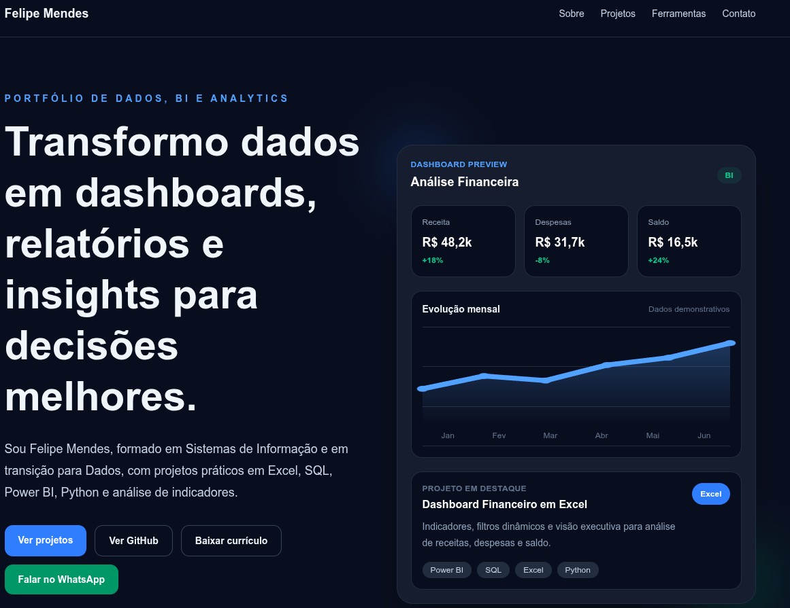

# Felipe Mendes Portfolio



Landing page profissional desenvolvida para apresentar projetos de **Dados, BI e Analytics**, com foco em dashboards, análise de dados, SQL, Excel, Power BI e Python.

## Objetivo

Criar uma vitrine profissional para apresentar projetos de dados de forma clara, visual e acessível para recrutadores, gestores e potenciais clientes.

O portfólio foi desenvolvido para demonstrar habilidades práticas em análise de dados, construção de dashboards, organização de informações, visualização de indicadores e documentação de estudos de caso.

## Tecnologias utilizadas

* Next.js
* TypeScript
* Tailwind CSS
* React
* Vercel

## Funcionalidades

* Página inicial responsiva
* Hero visual com conceito de dashboard
* Seção de projetos em destaque
* Cards com imagem, categoria, ferramentas e status
* Páginas individuais de estudos de caso
* Galeria de imagens com visualização em modal
* Links para GitHub, LinkedIn, WhatsApp, e-mail e currículo
* Metadata e Open Graph configurados para compartilhamento profissional

## Projetos apresentados

### Dashboard Financeiro em Excel

Projeto de estudo desenvolvido em Excel para análise financeira pessoal, com foco em indicadores, visualização de dados e acompanhamento de receitas, despesas, saldo e evolução mensal.

### Planilha de Controle Financeiro

Solução em Excel com dashboard, automações em VBA e recursos práticos para controle financeiro pessoal, acompanhamento de lançamentos e análise de indicadores.

### Análise de E-commerce com SQL

Projeto de análise de dados utilizando SQL para explorar pedidos, clientes, vendas, categorias e indicadores comerciais em uma base de e-commerce.

### Dashboard Comercial em Power BI

Projeto em desenvolvimento com foco em Business Intelligence, análise comercial, visualização de indicadores e construção de dashboards interativos.

## Como rodar localmente

Clone o repositório:

```bash
git clone https://github.com/Felipee-M/felipe-mendes-portfolio.git
```

Acesse a pasta do projeto:

```bash
cd felipe-mendes-portfolio
```

Instale as dependências:

```bash
npm install
```

Execute o servidor de desenvolvimento:

```bash
npm run dev
```

Acesse no navegador:

```txt
http://localhost:3000
```

## Build de produção

Para gerar a versão de produção:

```bash
npm run build
```

## Deploy

O projeto está publicado na Vercel:

```txt
https://felipe-mendes-portfolio.vercel.app
```

## Contato

* [Portfólio](https://felipe-mendes-portfolio.vercel.app)
* [GitHub](https://github.com/Felipee-M)
* [LinkedIn](https://www.linkedin.com/in/felipemendessantos)
* [E-mail](mailto:felipe.m.dos.santoss@gmail.com)
* [WhatsApp](https://wa.me/5582999511039)

